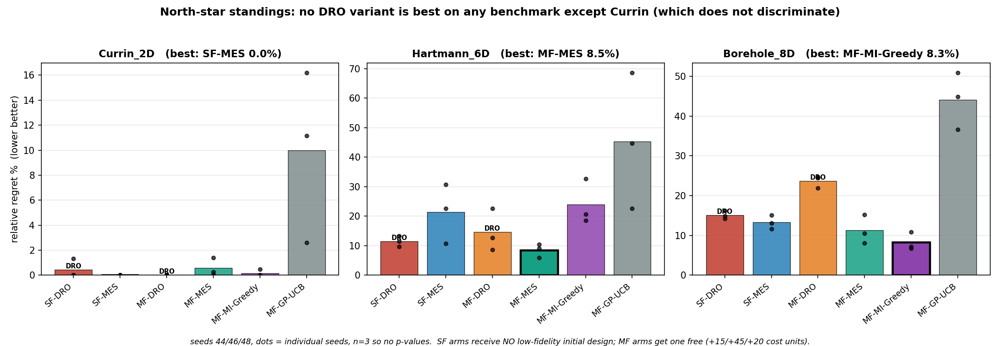
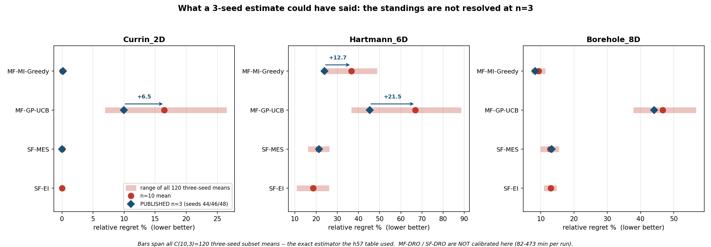
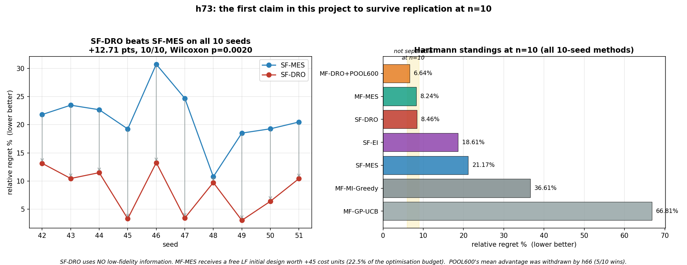
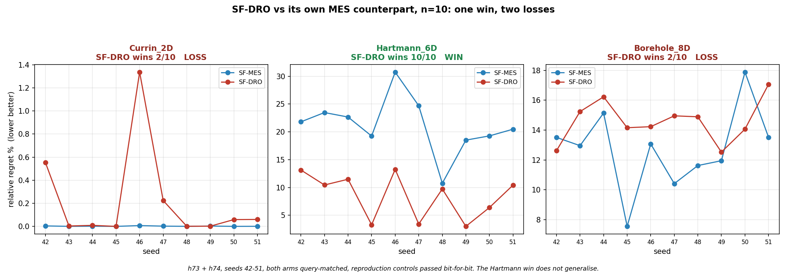

# MF-DRO failure modes on Hartmann 6D and Borehole 8D
### Evidence from H57 (36 runs), H58 (12 runs), H59 (18 runs). Every number below is measured.

**Setup common to all:** cost budget 200 post-init, seeds 44/46/48, one pinned
code commit recorded in every result file. Regret = f(x*) - best HF value found.
"rel" = regret / f(x*).

**Initial design is NOT symmetric - say this if asked.** All *multi-fidelity*
arms (H57) share an identical initial design. The *single-fidelity* arms (H59)
get the HF init only, no LF points. The initial design is also **not charged**
against the 200-unit budget, so MF arms receive free low-fidelity information
worth **+15 / +45 / +20** cost units on Currin / Hartmann / Borehole - on
Hartmann that is 22.5% of the optimization budget. This runs *against* MF, so
wherever SF beats MF below, that is a conservative statement rather than an
artifact.

---

## Headline: MF-DRO never beats the best baseline

**Updated to n=10 wherever it exists.** Sample size is marked per cell; the
originally published all-n=3 table is preserved below it, because four of these
numbers moved by more than 5 points.

| method | Currin 2D | Hartmann 6D | Borehole 8D |
|---|---|---|---|
| **MF-DRO** | 0.01% (n=3) | **8.91%** (n=10) | 22.89% (n=10) |
| **SF-DRO** | 0.22% (n=10) | 8.46% (n=10) | 14.60% (n=10) |
| MF-MES (Takeno) | 0.57% (n=3) | **8.24%** (n=10) | 11.28% (n=3) |
| SF-MES | **0.00%** (n=10) | 21.17% (n=10) | 12.76% (n=10) |
| MF-MI-Greedy | 0.06% (n=10) | 36.61% (n=10) | **9.29%** (n=10) |
| MF-GP-UCB | 16.46% (n=10) | 66.81% (n=10) | 46.65% (n=10) |

*Originally published (all n=3): MF-DRO 0.0 / 14.7 / 23.7 · SF-DRO 0.4 / 11.5 /
15.1 · MF-MES 0.6 / 8.5 / 11.3 · SF-MES 0.0 / 21.4 / 13.3 · MI-Greedy 0.2 / 23.9 /
8.3 · MF-GP-UCB 10.0 / 45.3 / 44.1.*

**What changed at n=10**, and it is not cosmetic:

| cell | n=3 | n=10 | shift |
|---|---|---|---|
| MF-DRO, Hartmann | 14.7% | **8.91%** | **−5.8** |
| MI-Greedy, Hartmann | 23.9% | **36.61%** | **+12.7** |
| MF-GP-UCB, Hartmann | 45.3% | **66.81%** | **+21.5** |
| MF-GP-UCB, Currin | 10.0% | 16.46% | +6.5 |
| SF-DRO, Hartmann | 11.5% | 8.46% | −3.0 |

**On Hartmann, four methods now cluster at 6.6-8.9%** (MF-DRO+POOL600 6.64,
MF-MES 8.24, SF-DRO 8.46, MF-DRO 8.91) with a 10-point gap to everything else.
The published table put MF-DRO mid-table and clearly behind MF-MES; **at n=10 they
are not separable** (paired: 4/10, p=0.2754, post hoc).

**The conclusion is unchanged: no DRO variant beats the best baseline on any
benchmark that discriminates.** Hartmann is a tie — an absence of evidence, not a
pass — and Borehole is a clear loss (MF-DRO 22.89% vs MI-Greedy 9.29%, confirmed
at n=10 not to be a three-seed artifact). SF-DRO still beats MF-DRO on both hard
benchmarks despite getting no free LF initial design, though on Hartmann the
margin is now 0.45 points rather than 3.2.

### READ THIS BEFORE QUOTING ANY HARTMANN NUMBER ABOVE

Every figure in that table is **n = 3 seeds**. h72 checked what that estimator can
do, by enumerating all C(10,3) = 120 three-seed subsets of a 10-seed run for the
cheap methods. The harness reproduces the published cells exactly (**+0.00**), so
these are the same numbers, better measured.

| benchmark | method | published n=3 | n=10 | shift |
|---|---|---|---|---|
| Hartmann | **MI-Greedy** | 23.9% | **36.6%** | **+12.7** |
| Hartmann | **MF-GP-UCB** | 45.3% | **66.8%** | **+21.5** |
| Currin | MF-GP-UCB | 10.0% | 16.5% | +6.5 |
| Borehole | MI-Greedy | 8.3% | 9.3% | +1.0 |
| Hartmann | SF-MES | 21.4% | 21.2% | −0.2 |

On Hartmann a three-seed draw of MF-GP-UCB could have landed anywhere between
**36.7% and 88.5%**; MI-Greedy anywhere between **22.8% and 48.8%**. Seeds
44/46/48 were a favourable draw for exactly those two. SF-MES moved by <= 0.5
everywhere, so this is **method-dependent noise, not a property of the benchmark**.

**What survives and what does not:**

- **Borehole orderings are robust.** MI-Greedy stays best (8.3% -> 9.3%). The
  pool-size result later in this deck is unaffected — it is a per-seed identity,
  not a mean comparison.
- **The Hartmann column is not resolved.** MI-Greedy's three-seed range overlaps
  SF-MES's and SF-EI's, so some draw would have reversed the published ordering.
- **MF-DRO and SF-DRO are NOT calibrated** — 82-473 min per run made n=10
  unaffordable. Their entries are of *unknown* reliability, and MF-DRO's Hartmann
  seeds (22.7% / 8.7% / 12.7%) show a spread comparable to methods whose means
  moved by more than 10 points.

This does **not** re-rank anything — unresolved is not reversed. But Hartmann is
the column the withdrawn north-star claim lived in, and no Hartmann magnitude in
this deck should be quoted as settled.

Paired wins for MF-DRO out of 3 seeds: **0-3 to MF-MES on Hartmann**,
**0-3 to both baselines on Borehole**. Currin does not discriminate — every
non-degenerate method finishes inside 0.6% of the optimum.

Wall clock: MF-DRO 82–114 min per run; MF-MI-Greedy 0.4–0.7 min. **120–230×.**

---

## THE TWO FAILURE MODES ARE DIFFERENT

### Hartmann 6D — RETRACTED. The original claim here was wrong.

**What I claimed:** the LF function's optimum (4.0019) exceeds HF's (3.3224), so
the fidelity head "chases" it and starves the incumbent.

**Why it is wrong — two independent reasons, both checked in code and data:**

**1. Nothing in the method scores LF by its own value.** The LF branch
(`_compute_mes_lf_vectorized`) is scored against `y_star_arr`, documented in
source as "shared **HF** Thompson samples". It computes information gain about
the *high-fidelity* optimum through `rho`, `mu_H`, `var_delta`. LF's own optimum
never enters any decision. And at real inference the fidelity is drawn from the
DT's `fidelity_head`, not from the MES argmax at all.

**2. The LF function is an EXCELLENT surrogate here, not a misleading one.**

| measurement | value |
|---|---|
| domain-wide corr(f_LF, f_HF) | **+0.925** |
| mean f_HF in the top-5% LF region | 1.4398 (domain mean 0.2588) |
| true HF value at the 176 LF-queried points, median | **3.0287 = 91% of f(x\*)** |

The LF budget went to a region genuinely containing near-optimal HF points. The
policy was not misled; it correctly located the good region cheaply.

**3. And the seed I called pathological is the BEST one.**

| seed | HF% | queries | regret | rel |
|---|---|---|---|---|
| **46** | **2%** | 179 | **0.2875** | **8.7%** |
| 48 | 28% | 67 | 0.4228 | 12.7% |
| 44 | 81% | 31 | 0.7531 | 22.7% |

**Regret is monotone in HF fraction, in the direction opposite to my claim.** The
LF-heaviest seed wins; the HF-heaviest loses. At c_H=8 vs c_L=1 with rho=0.925,
spending on the cheap fidelity is correct, and seed 44's 25 expensive HF queries
bought a worse answer than seed 46's 176 cheap ones.

**How the error happened:** I observed that 166/176 of seed 46's LF queries
exceeded f(x*)_HF and read it as evidence of chasing. The statistic is real and
extreme — uniform sampling puts only 0.1% of LF values above that line, so the
concentration is 94.3% vs 0.1% — but it measures that the policy found the good
region, not that it was lured somewhere bad.

**What remains true about Hartmann:** the fidelity split varies 81%/4%/28%
across seeds differing only by the initial-design draw, and h58's 25% floor
improved seed 46 by 22%. Both stand. But "the fidelity head chases a misleading
LF optimum" is withdrawn, and with it the framing that LF-heaviness is the
Hartmann failure mode.

### Borehole 8D — not a fidelity problem, and not a late plateau either

**1. It is already effectively single-fidelity.** 98-100% HF, spread 4 points
across seeds; only **1-3 LF queries per run**. There is nothing to misallocate,
so no fidelity-based explanation can apply here.

**2. It finishes 22-25% short of the optimum:**

| seed | best HF found | f(x\*) | shortfall |
|---|---|---|---|
| 44 | 233.94 | 309.58 | 24.4% |
| 46 | 232.99 | 309.58 | 24.7% |
| 48 | 241.61 | 309.58 | 22.0% |

**3. The gap opens EARLY and never closes.** Indexed by HF query number (not
cost), MF-DRO and MI-Greedy share the identical 10-point HF init and both start
at 72.07:

| HF query # | MF-DRO | MI-Greedy |
|---|---|---|
| 0 (shared init) | 72.07 | 72.07 |
| 10 | 173.07 | 219.71 |
| **20** | 190.38 | **264.41** |
| 109 | 236.18 | 283.97 |

**MI-Greedy reaches 264.41 within 20 HF queries; MF-DRO does not reach it in
109.** So this is *not* a method that converges and stalls — it is one whose
first ~20 high-fidelity evaluations are worth about a third less than a greedy
baseline's, from an identical starting point.

**4. Calibrated against random search**, which puts the size of the deficit in
context:

| strategy | best HF found |
|---|---|
| random search, 100 evals | 200.94 |
| **MF-DRO, 99 HF queries** | **236.18** |
| random search, 1000 evals | 240.32 |
| random search, 20000 evals | 266.08 |
| **MI-Greedy, 100 HF queries** | **283.97** |

MF-DRO's 99 queries buy roughly what 1000 random draws buy — it *is* optimising,
about 10x better than random. MI-Greedy's 100 beat what **20,000** random draws
buy. Same budget, same start.

**5. The search is not in the wrong place.** Stalled queries sit at the
**99.7-99.9th percentile** of the domain's value distribution (20k Sobol
reference), against incumbents at 99.8-99.9th.

> **Borehole in one line:** fidelity is inert, the queries are in the top 0.3% of
> the domain by value, and the deficit is concentrated in the first ~20
> high-fidelity evaluations rather than in a late plateau.

**Mechanism: unresolved. Say so.** Three geometric explanations were proposed
and each was refuted by measurement — (a) an uninformative LF corrupting the
surrogate (corr(f_LF,f_HF) = **1.000** on Borehole), (b) failure to refine
locally (MF-DRO is the *only* method that contracts, 0.68x, and it loses), and
(c) boundary aversion preventing it reaching a corner optimum (its queries are
the **closest** to x*, 0.900 vs 1.030 and 1.175, and it is the worst). A
follow-up ablation (H60) then excluded the reward schema and the LF initial
design, and showed the rollout teacher is load-bearing — swapping it moved regret
23.7% -> 43.8%.

**Both remaining candidates have since been tested. The chain is now complete.**

| candidate | tested by | result |
|---|---|---|
| Inner-loop optimisation | h68 | **Not it.** MF-DRO's own choices outrank MI-Greedy's under MF-DRO's own acquisition in **8 of 9** cells. It maximises its acquisition well and still loses |
| Acquisition class (MES vs EI) | h69 | **Not it.** Swapping MES for EI with the surrogate held bit-for-bit fixed moves Borehole **0.29** of the 5.0-point gap |
| Surrogate construction | h70 | **Not it.** Two materially different GP builders (max lengthscale difference 4.27) give **identical** regret on Borehole |
| Candidate pool size | h70 | **This is the baselines' whole story.** SF-EI at 1000 candidates reproduces MI-Greedy **exactly, seed for seed**, residual +0.00 |
| Teacher pool size (MF-DRO) | h71 | **Load-bearing but insufficient.** 200 -> 1000 moves Borehole **23.71% -> 17.66%, 3/3** — about a third of the gap. n=3, replication running |

**The one-line version for the slide:** MI-Greedy's advantage over the
single-fidelity MES baseline on Borehole is candidate pool size on **8 of 10
seeds** — SF-EI at 1000 candidates reproduces it *bit-for-bit* on those eight
(h79, n=10). For MF-DRO the same lever is real but closes only a third of the
gap, and what remains after eight eliminated candidates is still unexplained.

> **Correction:** an earlier version of this deck said "*entirely* pool size",
> from a 3-seed check (h70) whose three seeds all happen to be among the eight
> that match. At n=10 two seeds diverge by 1.23 and 3.00 points, with the
> pool-matched baseline **worse** on both. Pool size still explains the great
> majority; "entirely" does not survive.

> **Caveat to state:** the POOL1000 result is **three seeds**. Three of four n=3
> directions in this project have failed at n=10, one reversing sign. The
> replication is running with a pre-registered withdrawal condition (< 3.0 points
> or <= 6/10 wins). Do not present it as established.

---

## What was RULED OUT by measurement (do not put these on the slide as causes)

| ruled out | evidence |
|---|---|
| **Incumbent freeze** (same point re-proposed) | `distinct == n_queries` in **all 9** MF-DRO cells, up to 116 queries |
| **Aimless / low-value search** | stalled HF queries at the 88.7–99.9th percentile of domain value |
| **Searching far from the optimum** | retracted: on Hartmann the best value within 0.3 of x* (2.9196) equals the best beyond 1.0 away (2.8338), so distance to x* carries no information |

---

---

## Threads CLOSED by measurement — do not re-open without a new reason

Each of these was a live hypothesis about why MF-DRO underperforms. Each is now
answered, and the answer is negative.

| thread | verdict | key evidence |
|---|---|---|
| **Fidelity allocation** | not the lever | corr(HF%, regret) = −0.685 overall but **+0.071** excluding a 2%-HF outlier; regret spans only 19.3–24.7% across 18–98% HF |
| **rho / KO misspecification** | rho is a *regulariser*, not a slope estimate | fitted rho is 0.84 / 0.78 / 0.84 vs true slopes 1.26 / 0.98 / 1.01 — **the (0,1) ceiling never binds anywhere**. Pinning rho to the *true* slope was **−16.6%** on Hartmann, where it is representable |
| **Incumbent stall** | stall length carries no signal | in HF-opportunity units MF-DRO and MI-Greedy tie at **34%** terminal stall with opposite regret; MI-Greedy has the *lowest* terminal stall on Hartmann (2%) and the *worst* regret there |
| **"DRO buys consistency, not mean"** | refuted | DRO has lower sd in 4/6 pairs but lower **worst-case** regret in only **2/6**. Borehole SF-DRO: lower sd (1.02 vs 1.77) around a *worse* mean **and** a worse worst case |

The rho thread matters most: it retires an entire family of follow-ups ("fit rho
more faithfully" — better link, more optimizer steps, OLS init), because h63's
own control shows the *faithful* rho is not the *good* rho. A planned experiment
(H67, unbounded rho via softplus) was built, its regression gate passed, and it
was **cancelled before launch** when a three-minute pre-flight refuted its
premise — 6 jobs avoided.

---

## ONE RESULT THAT SURVIVED — SF-DRO on Hartmann (n=10)

SF-DRO beats its own MES counterpart on Hartmann at **n=10**, on **every seed**:

| | mean | sd | worst |
|---|---|---|---|
| **SF-DRO** | **8.46%** | 4.08 | 13.26% |
| SF-MES | 21.17% | 5.11 | 30.74% |

**+12.71 points, 10/10 paired wins, Wilcoxon p = 0.0020.** The verdict script was
committed before any seed had run. Two checks were then **run, not assumed**: the
two arms are **query-matched** (both take exactly 25 optimization iterations on
all 10 seeds), and a **reproduction control passes bit-for-bit** — the new
worker reproduces the earlier code's seed-44 result to 0.000e+00.

This is the **only** claim in this project to survive replication at n=10 — three
earlier ones did not, and one reversed sign. Note it also went the *other* way
from the usual failure: the 3-seed estimate **understated** the gap (9.9 vs
12.71 points).

**But it does not clear the bar.** Against the strongest baseline on Hartmann the
comparison is a tie, not a win:

| method | n=10 |
|---|---|
| MF-DRO + POOL600 | 6.64% (advantage withdrawn — 5/10 wins) |
| MF-MES | 8.24% |
| **SF-DRO** | **8.46%** — no low-fidelity information at all |
| SF-EI | 18.61% |
| SF-MES | 21.17% |

SF-DRO vs MF-MES is **4/10, p = 0.43** — indistinguishable. That comparison is
**post hoc** (the data existed before the question was asked) and is not a claim.
What is fair to say: SF-DRO reaches the top cluster **without any low-fidelity
information**, while MF-MES gets a free LF initial design worth 22.5% of the
optimisation budget.

**Scope: it does not generalise. Tested and settled.**

| benchmark | SF-DRO | SF-MES | gap | SF-DRO wins | Wilcoxon p |
|---|---|---|---|---|---|
| Hartmann 6D | **8.46%** | 21.17% | **+12.71** | **10/10** | 0.0020 |
| Borehole 8D | 14.60% | **12.76%** | −1.84 | **2/10** | 0.0840 |
| Currin 2D | 0.22% | **0.00%** | −0.22 | **2/10** | 0.0137 |

**One win, two losses.** The n=3 losses on Borehole and Currin were *not* noise —
they replicated at n=10 with the same sign. SF-DRO is not generally better than
its own MES counterpart; it is better on Hartmann.

Both arms are **query-matched** (same 25 optimization iterations, same initial
design) and both experiments passed **bit-for-bit reproduction controls**.

One nuance worth stating if asked: on Hartmann the two methods' *three-seed*
ranges are **disjoint** — SF-DRO's worst possible 3-seed draw (12.63%) still beats
SF-MES's best (16.18%) — so no choice of three seeds could have reversed that
result. On Borehole the ranges overlap, and what settles it is the paired count
(2/10), not the means.

---

## RESOLVED — and the answer is a WITHDRAWAL

**Did widening the acquisition candidate pool (200 -> 600) help on Hartmann?**
At n=3 it measured 7.6% vs MF-MES's 8.5% and was announced as this project's
first result beating a baseline. Replicated at **n=10**, with the analysis script
committed while the arm stood at 0/7:

| | POOL600 | MF-MES |
|---|---|---|
| mean | 0.2207 (6.6%) | 0.2737 (8.2%) |
| **paired wins** | **5/10** | 5/10 |
| Wilcoxon p | **1.0000** | |

The pre-registered failure branch (<=5/10 wins) **fired**.

**The mean advantage is a single seed.** It comes almost entirely from seed 49,
where MF-MES posts its worst run of the ten (0.8390 vs POOL600's 0.0667).
Excluding that seed the advantage **reverses** — MF-MES ahead by 0.0270. The
median gap is 0.0103. The protocol demanded both a better mean *and* >=6/10 wins
precisely because at n=10 one catastrophic baseline run moves a mean further than
the effect being tested.

> **Say this plainly on the slide: the claim is withdrawn. No DRO variant in this
> project beats the best baseline on any benchmark that discriminates, and none
> ever did.**

This is the second time the same shape has appeared — h45 read 5/6, then 7/8,
then finished worst-on-mean at 10/10. The difference is that this time the
withdrawal condition was written down before the data existed, so the result was
read rather than argued about.

## Caveats to state out loud

- **n = 3 seeds per cell. No p-values.** Directions and paired win counts only.
- The best baseline **changes identity by benchmark** (MF-MES on Hartmann,
  MI-Greedy on Currin and Borehole), so "at least as good as the baselines" is a
  per-benchmark bar, not one number.
- **MF-GP-UCB is not a competitor** — it is structurally all-LF on all three
  benchmarks (its cost ratio exceeds the fidelities' prior variance ratio
  everywhere), so its incumbent only moves on initial-design points. Present it
  as a floor or omit it.
